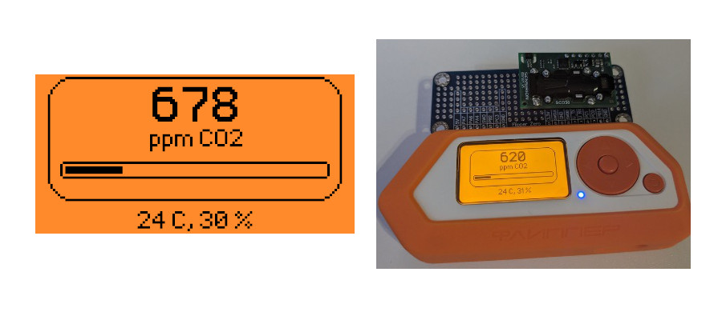

# Flipper Zero SCD30 CO2 Monitor

CO2 monitor and data logger for Flipper Zero. This started as a port of https://github.com/thzinc/flipperzero-firmware to a recent version and evolved to a completetly new project.

## Wiring
- SCD30 VIN <--> 3.3V
- SCD30 GND <--> GND
- SCD30 SCL <--> PC0
- SCD30 SDA <--> PC1

## Features

- Displays CO2, Temperature, Humidity
- Permanent logging to a CSV file
- LED Color based on current CO2 level (500 = green ... 2500 = red)

## TODOs

- Calibration